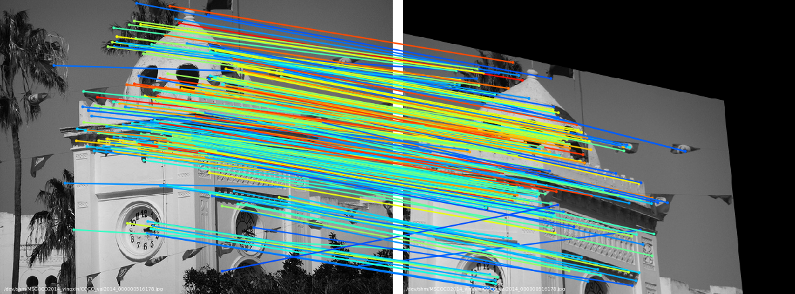
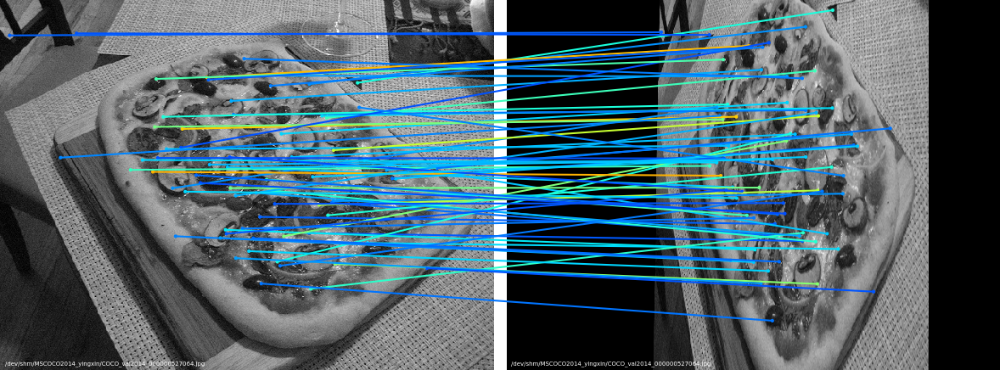

Our codes refer to https://github.com/yingxin-jia/SuperGlue-pytorch and https://github.com/magicleap/SuperGluePretrainedNetwork. We replaced the CNN backbone of encoder with equivariant steerable CNNs with the help of the e2cnn Pytorch package. 
SuperGlue is self-supervised training and does not require manual annotation.

## Dependencies
* Python 3
* PyTorch >= 1.1
* OpenCV >= 3.4 (4.1.2.30 recommended for best GUI keyboard interaction, see this [note](#additional-notes))
* Matplotlib >= 3.1
* NumPy >= 1.18

Simply run the following command: `pip3 install numpy opencv-python torch matplotlib`

Or create a conda environment by `conda install --name myenv --file superglue.txt`

## Contents
There are two main top-level scripts in this repo:

1. `train.py` : trains the superglue model.
2. `load_data.py`: reads images from files and creates pairs. It generates keypoints, descriptors and ground truth matches which will be used in training.

### Download Data
Download the COCO2014 dataset files for training
```
wget http://images.cocodataset.org/zips/train2014.zip
```
Download the validation set
```
wget http://images.cocodataset.org/zips/val2014.zip
```
Download the test set
```
wget http://images.cocodataset.org/zips/test2014.zip
```

### Training Directions

To train the SuperGlue with default parameters, run the following command:

```sh
python train.py
```

### Additional useful command line parameters
* Use `--epoch` to set the number of epochs (default: `20`).
* Use `--train_path` to set the path to the directory of training images.
* Use `--eval_output_dir` to set the path to the directory in which the visualizations is written (default: `dump_match_pairs/`).
* Use `--show_keypoints` to visualize the detected keypoints (default: `False`).
* Use `--viz_extension` to set the visualization file extension (default: `png`). Use pdf for highest-quality.

### Visualization Demo
The matches are colored by their predicted confidence in a jet colormap (Red: more confident, Blue: less confident).

You should see images like this inside of `dump_match_pairs/`







